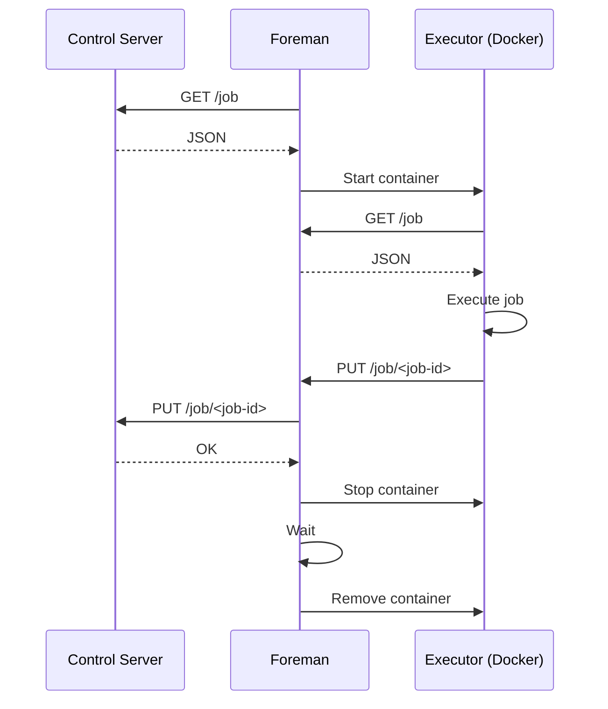

# foreman

Foreman is a Rust based job scheduler and executor agent.

## Features

- **💬 Language agnostic**: Jobs are processed in containerised environments.
- **🔐 Secure by default**: Self-hostable behind a NAT gateway, without the need to be exposed publically over the internet.
- **🚀 Fast, efficient and lightweight**: Compiles to a single binary executable

## Installation

Install the Rust toolchain via rustup.

```bash
curl --proto '=https' --tlsv1.2 -sSf https://sh.rustup.rs | sh
```

Compile release build.

```bash
cargo build --release
```

## Usage

The foreman binary expects to find a configuration file named `foreman.toml` in one of the following locations:

- The current working directory
- `$HOME/.foreman/foreman.toml`
- At a path specified by the `FOREMAN_CONFIG` environment variable. e.g. `FOREMAN_CONFIG=/path/to/foreman.toml`

Refer to [example.foreman.toml](example.foreman.toml) for an explanation of the various configuration options and their defaults.

Alternatively, config values can be specified via environment variables.
Each environment variable should be prefixed with `FOREMAN_`.

For example ...

```toml
[core]
port = 8080
```

... can be specified via the environment variable `FOREMAN_CORE_PORT=8080`.

Values set via environment variables will override any values specified in `foreman.toml`.

### Labels

Labels are optional key/value pairs which you can define in the `[core.labels]` section of `foreman.toml`.
These labels will be sent to your control server in the header `x-foreman-labels` when polling for jobs.

Your control server MAY discriminate requests based on these labels and only deliver matching jobs.
For example, you may choose to identify features of the forman agent host by defining labels such as `cpu = 4`, `gpu = true` etc.

Similarly, your control server may maintain multiple job queues.
Labels allow you to assign agents to specific queues e.g. `queue = high-priority`, `queue = low-priority` etc.

Labels are formatted as a comma-separated list of key/value pairs e.g `cpu=4,gpu=true,queue=high-priority`.
Both keys and values will be URL-encoded so you are free to use '=' and ',' in your labels.
The trade-off here is you need to remember to URL-decode before usage on your control server.
The order of the key/values is NOT guaranteed.

## Concepts

### Foreman

Foreman (this project) is a self-hostable Rust-based agent which retrieves jobs from a control server and executes them inside a containerised environment.
It is intentionally designed to be run in private subnets behind a NAT gateway, without the need to be exposed to the internet directly.

Foreman is similar in spirit to a CI/CD agent but more generic.

### Control Server

At a high level, a control server is a responsible for the following:

- Serves jobs to foreman agents
- Retrieves job execution statuses from foreman agents

The implementation of a control server is not within the scope of this project, though a reference implementation is included for development purposes.
See the Development section below for more information.

### Job

A job defines a single task that needs to be executed.
It can be anything from running a script to deploying an application.

### Executor

An executor is responsible for executing jobs on behalf of a foreman agent.

Foreman manages Docker as it's job executor.
A custom bridge network is created on start-up which all containers created by foreman are added to.
By default the network is named `foreman`.
This can be changed via the `core.network_name` configuration option.

## Sequence diagram

The following sequence diagram illustrates the flow of a job execution request between foreman, a control server and an executor.



## Job schema

A job returned by a control server is expected to conform to the following schema (denoted here as a Typescript interface):

```typescript
interface Job {
    /**
     * Unique identifier for the job
     */
    id: string;

    /**
     * Docker image to use for the job
     */
    image: string;

    /**
     * Port to expose on the container
     */
    port: number;

    /**
     * Command to run in the container
     */
    command?: string[];

    /**
     * Body of the job, which can be any type
     */
    body: any;

    /**
     * Environment variables for the job
     */
    env?: { [key: string]: string };

    /**
     * Callback URL for the job
     */
    callbackUrl: string;

    /**
     * Whether to always pull the Docker image before creating a container
     */
    alwaysPull: boolean;
}
```

Some things to note:

- The `id` is used to uniquely identify each job and should be unique within your control server.
  Using a UUID is recommended.
- The `callbackUrl` does not need to be the same server as your control server (though you will likely still need to signal back to your control server when the job completes).
- Avoid setting `alwaysPull: true` as it will slow down the creation of job containers. 
  You should only need this if your image tags are **mutable** which is generally considered bad practice.
- The job schema is also available in JSON schema format in [job.schema.json](job.schema.json).

## Authoring a job processor image

Foreman will create a container based on the `image` field defined in a job, pulling the image if necessary.

The foreman agent exposes a simple REST API which job containers are expected to communicate with when dealing with their associated job.

When a container is ready it MUST perform a GET request to the URL contained in the `FOREMAN_GET_JOB_ENDPOINT` environment variable.
This endpoint returns a JSON object containing the job `id` and `body` fields from the original job received from the control server.

Likewise the container MUST perform a PUT request to the URL contained in the `FOREMAN_PUT_JOB_ENDPOINT` environment variable with updates to the job's status.
When sending requests to this endpoint the only requirement is the following headers must be set in the request.

| name                   | required | description                                                                                 |
| ---------------------- | -------- | ------------------------------------------------------------------------------------------- |
| x-foreman-job-status   | YES      | MUST be either 'running' or 'completed'                                                     |
| x-foreman-job-progress | NO       | A floating point number representing the progress of the job. Defaults to 0.0 if undefined. |

Requests sent to this endpoint are forwarded to the job's `callbackUrl` as-is.
The `completed` status is a terminal state and can be set at-most once per job.
It is invalid to send a PUT request with `x-foreman-job-status` set to `running` on a completed job.

A container becomes eligible for removal once it's status changes to `completed`.

## Development

### 1. Build the Test image

Build the test job image so it is available on your local machine.
This image is used by jobs produced by the reference control server (see next step).

```
cd examples/test_job_image
docker build -t foreman-test-job-image:latest .
```

### 2. Run the reference control server

A reference control server, using Typescript and Deno, is defined in `examples/control_server`.

To run the server, `cd` into the `examples/control_server` directory and run:

```bash
deno run -A index.ts
```

### 3. Configure foreman

Update your `foreman.toml` file to contain the following configuration.
This allows code running inside the test image to reach the foreman process running on your host machine.

```toml
[core]
url = 'http://localhost:8888/job'
token = 'MY-SUPER-SECRET-TOKEN'
hostname = "host.docker.internal"
extra_hosts = ["host.docker.internal:host-gateway"]
```

### 4. Run foreman

In a separate terminal, start foreman.

```bash
cargo run
```