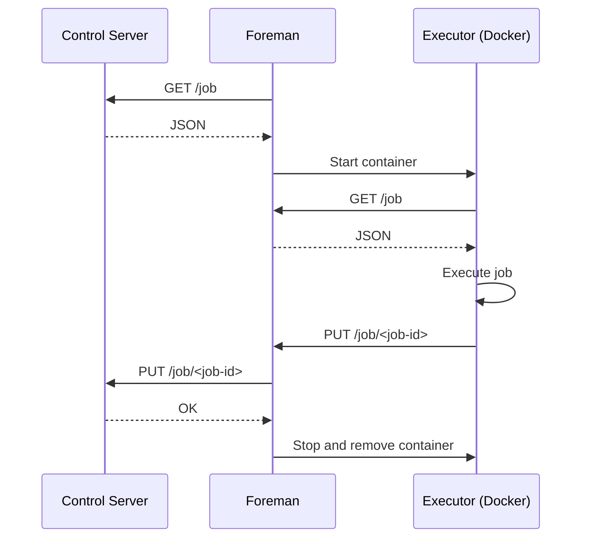

# foreman

TODO

## Features

- **Language agnostic**: Jobs are processed in containerised environments.
- **Secure by default**: Self-hostable behind a NAT gateway, without the need to be exposed to the internet directly.
- **Fast, efficient and lightweight**: Foreman is a single, Rust-based binary

## Installation

Install the Rust toolchain via rustup.

```bash
curl --proto '=https' --tlsv1.2 -sSf https://sh.rustup.rs | sh
```

Compile release build.

```bash
cargo build --release
```

## Usage

TODO

## Concepts

### Foreman

Foreman (this project) is a self-hostable Rust-based agent which retrieves jobs from a control server and executes them inside a containerised environment.
It is intentionally designed to be run in private subnets behind a NAT gateway, without the need to be exposed to the internet directly.

Foreman is similar in spirit to a CI/CD agent but more generic.

### Control Server

At a high level, a control server is a responsible for the following:

- Serves jobs to foreman agents
- Retrieves job execution statuses from foreman agents

The implementation of a control server is not within the scope of this project, though a reference implementation is included for development purposes.
See the Development section below for more information.

TODO - publish an OpenAPI spec

### Job

A job is a single task that needs to be executed.
It can be anything from running a script to deploying an application.

### Executor

An executor is responsible for executing jobs on behalf of a foreman agent.

Foreman uses Docker as it's job executor.

## Sequence diagram

The following sequence diagram illustrates the flow of a job execution request between foreman, a control server and an executor.



## Job schemas

TODO

## Development

A reference control server is defined in `control_server`.

To run the server, `cd` into the `control_server` directory and run:

```bash
deno run -A index.ts
```

In a separate terminal, start foreman.

```bash
cargo run
```